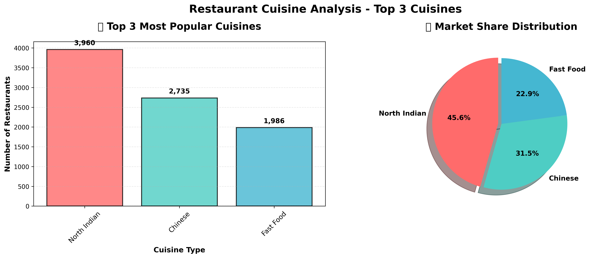
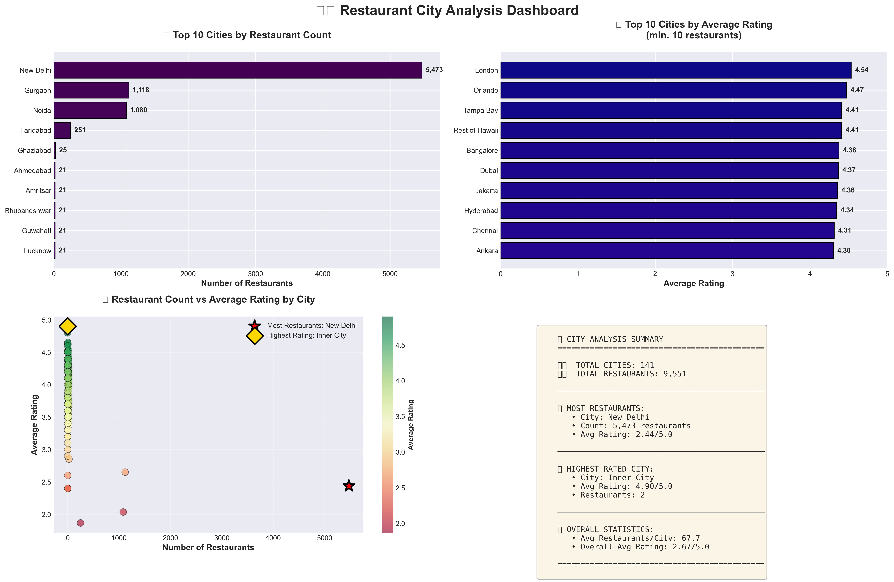
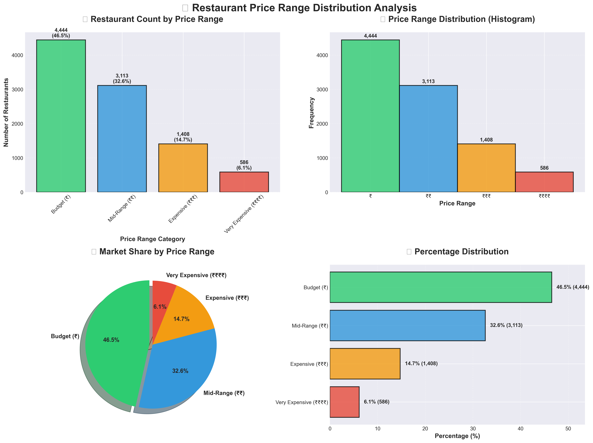
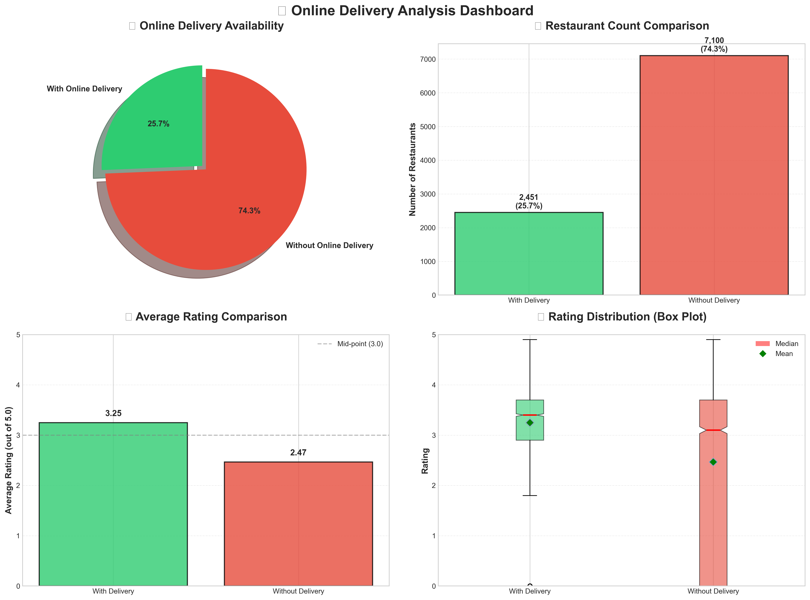
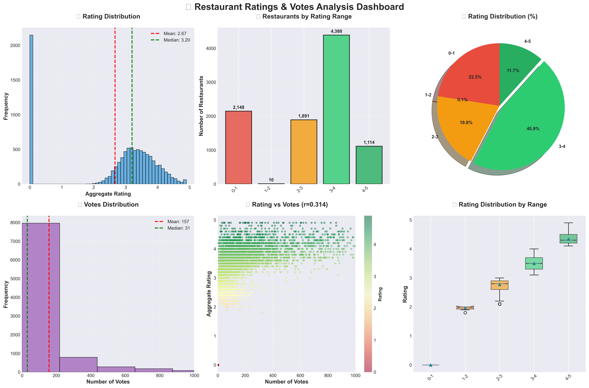
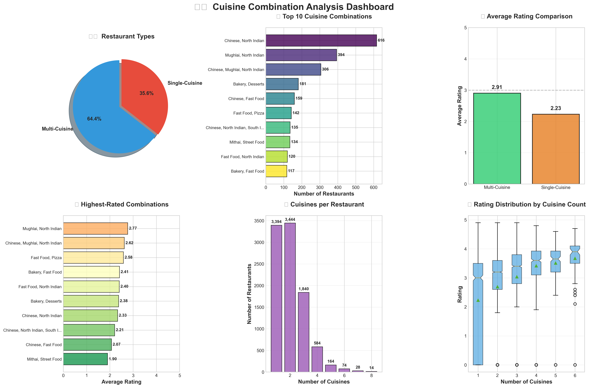
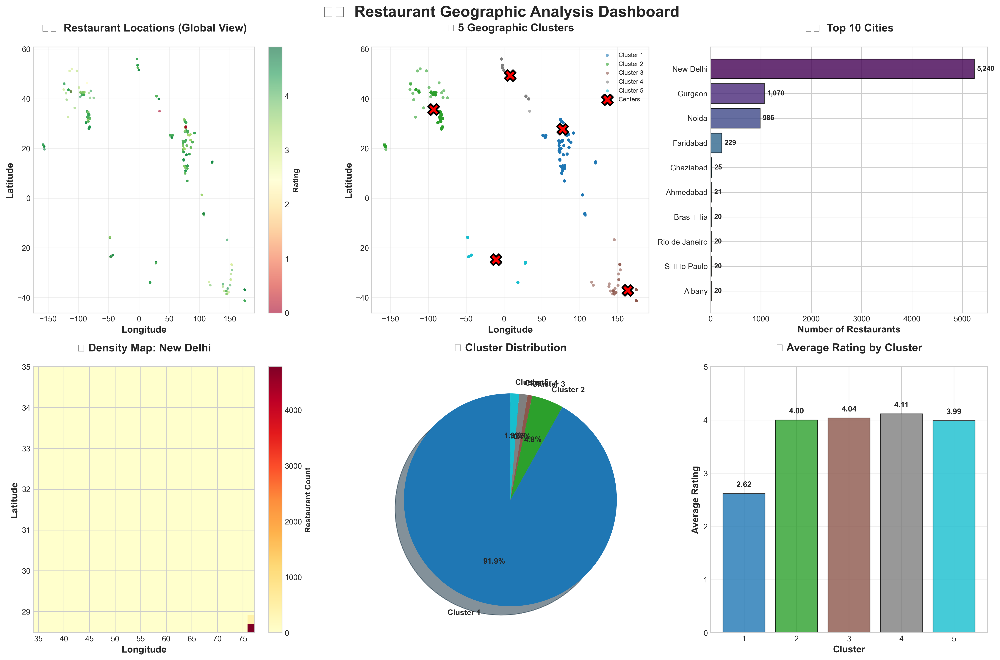
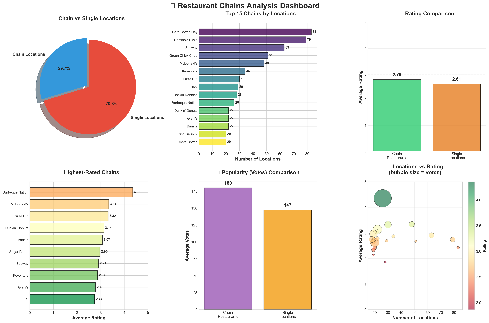

# Congnifyz Internship - Data Analysis Complete Project

A comprehensive Python data analysis project analyzing restaurant data across multiple dimensions including cuisines, cities, pricing, delivery services, ratings, geographic distribution, and chains.

## 📁 Project Structure

```
Y:\Main\
├── Data\
│   └── Dataset_.csv                    # Main dataset (9,551 restaurants)
│
├── Level-1\                           # Basic Analysis Tasks
│   ├── Task-1\                        # Top Cuisines Analysis
│   ├── Task-2\                        # City Analysis
│   ├── Task-3\                        # Price Range Distribution
│   └── Task-4\                        # Online Delivery Analysis
│
├── Level-2\                           # Advanced Analysis Tasks
│   ├── Task-1\                        # Restaurant Ratings Analysis
│   ├── Task-2\                        # Cuisine Combination Analysis
│   ├── Task-3\                        # Geographic Analysis
│   └── Task-4\                        # Restaurant Chains Analysis
│
└── README.md                          # This file
```

## 📊 Dataset Overview

- **Total Restaurants**: 9,551
- **Columns**: 21 (including location, cuisine, rating, votes, pricing, delivery)
- **Cities**: 141 unique cities
- **Cuisines**: 1,800+ unique cuisine types
- **Geographic Coverage**: Global (coordinates included)

---

# 🎯 LEVEL 1: Basic Analysis

## 📋 Task 1: Top Cuisines Analysis

**Objective**: Identify and visualize the top 3 most popular cuisines in the dataset.

### 📊 Key Findings
- **Top Cuisine**: North Indian (3,960 restaurants, 41.50%)
- **2nd Place**: Chinese (2,735 restaurants, 28.66%)
- **3rd Place**: Fast Food (1,986 restaurants, 20.81%)

### 📈 Visualizations


**Charts Included**:
- Category horizontal bar chart
- Market share pie chart

### 📝 Summary
North Indian cuisine dominates the market with over 40% share, followed by Chinese and Fast Food. The top 3 cuisines represent over 90% of all restaurants.

### 🔧 Files
- `task1.py` - Main analysis script
- `output/top_cuisines_analysis.png` - Dashboard (300 DPI)
- `output/cuisine_analysis_summary.txt` - Detailed report

---

## 🏙️ Task 2: City Analysis

**Objective**: Identify cities with the most restaurants and highest average ratings.

### 📊 Key Findings
- **Most Restaurants**: New Delhi (5,473 restaurants, 57.3%)
- **Highest Average Rating**: Inner City (4.90/5.0)
- **Total Cities**: 141

### 📈 Visualizations


**Charts Included**:
- Top 10 cities by count (horizontal bar)
- Top 10 cities by rating (horizontal bar)
- Restaurant count vs rating (scatter plot with stars)
- Summary statistics panel

### 📝 Summary
New Delhi dominates with over half of all restaurants, but smaller cities like Inner City achieve higher average ratings. This suggests a quality vs quantity trade-off.

### 🔧 Files
- `task2.py` - Main analysis script
- `output/city_analysis_charts.png` - 4-panel dashboard
- `output/city_analysis_summary.txt` - City statistics

---

## 💰 Task 3: Price Range Distribution

**Objective**: Analyze the distribution of price ranges and calculate percentages.

### 📊 Key Findings
- **Budget (₹)**: 4,444 restaurants (46.53%)
- **Mid-Range (₹₹)**: 3,113 restaurants (32.59%)
- **Expensive (₹₹₹)**: 1,408 restaurants (14.74%)
- **Very Expensive (₹₹₹₹)**: 586 restaurants (6.14%)
- **Affordable Segment**: 79.12% (Budget + Mid-Range)

### 📈 Visualizations


**Charts Included**:
- Vertical bar chart with percentages
- Frequency histogram
- Market share pie chart
- Horizontal percentage bar

### 📝 Summary
Nearly half of all restaurants are budget-friendly, with 79% falling in the affordable category. Premium dining represents only 21% of the market, indicating strong focus on value.

### 🔧 Files
- `task3.py` - Main analysis script
- `output/price_range_distribution.png` - 4-panel dashboard
- `output/price_range_summary.txt` - Pricing insights

---

## 🚚 Task 4: Online Delivery Analysis

**Objective**: Determine delivery availability percentage and compare ratings.

### 📊 Key Findings
- **With Online Delivery**: 2,451 restaurants (25.66%)
- **Without Delivery**: 7,100 restaurants (74.34%)
- **Rating Impact**: +0.78 points HIGHER with delivery (31.6% improvement!)
- **Delivery Avg Rating**: 3.25/5.0
- **No Delivery Avg Rating**: 2.47/5.0

### 📈 Visualizations


**Charts Included**:
- Delivery availability pie chart
- Restaurant count comparison bar
- Average rating comparison bar
- Rating distribution box plot

### 📝 Summary
Only 26% offer online delivery, but those that do achieve significantly higher ratings. Strong positive correlation suggests delivery enhances customer satisfaction.

### 🔧 Files
- `task4.py` - Main analysis script
- `output/online_delivery_analysis.png` - 4-panel dashboard
- `output/online_delivery_summary.txt` - Delivery analysis

---

# 🚀 LEVEL 2: Advanced Analysis

## ⭐ Task 1: Restaurant Ratings Analysis

**Objective**: Analyze rating distribution, identify common ranges, and calculate average votes.

### 📊 Key Findings
- **Average Rating**: 2.67/5.0
- **Median Rating**: 3.20/5.0
- **Most Common Range**: 3-4 (Good) - 4,388 restaurants (45.94%)
- **Average Votes**: 156.91 per restaurant
- **Rating-Votes Correlation**: 0.314 (moderate positive)

### 📈 Visualizations


**Charts Included**:
- Rating distribution histogram with mean/median
- Restaurants by rating range bar chart
- Rating distribution pie chart
- Votes distribution histogram
- Rating vs votes scatter plot
- Rating distribution box plot by range

### 📝 Summary
Most restaurants (46%) fall in the "Good" (3-4) rating range. Moderate positive correlation between ratings and votes suggests popular restaurants tend to have better ratings.

### 🔧 Files
- `task1.py` - Main analysis script
- `output/restaurant_ratings_analysis.png` - 6-panel dashboard
- `output/restaurant_ratings_summary.txt` - Statistical report

---

## 🍽️ Task 2: Cuisine Combination Analysis

**Objective**: Identify common cuisine combinations and their rating patterns.

### 📊 Key Findings
- **Most Common Combo**: Chinese, North Indian (616 restaurants)
- **Multi-Cuisine**: 6,148 restaurants (64.37%)
- **Single-Cuisine**: 3,403 restaurants (35.63%)
- **Rating Impact**: Multi-cuisine rates 0.68 points HIGHER (2.91 vs 2.23)
- **Total Combinations**: 734 unique combinations

### 📈 Visualizations


**Charts Included**:
- Single vs multi-cuisine pie chart
- Top 10 combinations horizontal bar
- Rating comparison bar chart
- Highest-rated combinations
- Cuisines per restaurant distribution
- Rating by cuisine count box plot

### 📝 Summary
64% of restaurants serve multiple cuisines and achieve 30% higher ratings. The most popular combination is Chinese + North Indian, appearing in over 600 restaurants.

### 🔧 Files
- `task2.py` - Main analysis script
- `output/cuisine_combination_analysis.png` - 6-panel dashboard
- `output/cuisine_combination_summary.txt` - Combination insights

---

## 🗺️ Task 3: Geographic Analysis

**Objective**: Plot restaurant locations and identify geographic clusters.

### 📊 Key Findings
- **Geographic Clusters**: 5 distinct clusters identified (K-Means)
- **Largest Cluster**: New Delhi area (5,473 restaurants)
- **Total Cities**: 141
- **Coordinate Range**: Global coverage (lat: -41.33° to 55.98°)
- **Urban Concentration**: Top 3 cities contain majority

### 📈 Visualizations


**Charts Included**:
- Global scatter plot (colored by rating)
- 5 geographic clusters with centers marked
- Top 10 cities bar chart
- Density heatmap (top city)
- Cluster distribution pie chart
- Average rating by cluster bar chart

### 📝 Summary
Strong urban concentration with New Delhi dominating (57%). K-Means clustering reveals 5 distinct geographic markets. Density analysis shows significant market saturation in major metros.

### 🔧 Files
- `task3.py` - Main analysis script (uses scikit-learn)
- `output/geographic_analysis.png` - 6-panel dashboard
- `output/geographic_analysis_summary.txt` - Location insights

---

## 🏢 Task 4: Restaurant Chains Analysis

**Objective**: Identify chains, analyze their ratings and popularity compared to independents.

### 📊 Key Findings
- **Restaurant Chains**: 734 chains identified
- **Top Chain**: Cafe Coffee Day (83 locations)
- **Chain Locations**: 2,839 (29.7% of all restaurants)
- **Rating Impact**: Chains rate 0.18 points HIGHER (2.79 vs 2.61)
- **Popularity**: Chains receive more votes on average
- **Highest Rated Chain**: Barbeque Nation (4.35★, 26 locations)

### 📈 Visualizations


**Charts Included**:
- Chain vs single location pie chart
- Top 15 chains by locations
- Rating comparison (chains vs singles)
- Highest-rated chains
- Votes comparison
- Locations vs rating scatter (bubble = votes)

### 📝 Summary
734 chains operate 2,839 locations. Chains outperform independent restaurants in both ratings and popularity, suggesting brand consistency provides competitive advantage.

### 🔧 Files
- `task4.py` - Main analysis script
- `output/restaurant_chains_analysis.png` - 6-panel dashboard
- `output/restaurant_chains_summary.txt` - Chain analysis

---

## 🛠️ Technical Stack

### Core Libraries
```python
pandas >= 1.0          # Data manipulation
matplotlib >= 3.0      # Visualization
seaborn >= 0.11        # Enhanced plots
numpy >= 1.18          # Numerical operations
scikit-learn >= 0.24   # Machine learning (clustering)
```

### Installation
```bash
pip install pandas matplotlib seaborn numpy scikit-learn
```

---

## 🚀 Quick Start

### Running Individual Tasks

**Level 1 - Task 1 (Top Cuisines)**:
```bash
cd "Y:\Main\Level-1\Task-1"
python task1.py
```

**Level 2 - Task 3 (Geographic Analysis)**:
```bash
cd "Y:\Main\Level-2\Task-3"
python task3.py
```

### Running All Tasks
```bash
# Navigate to each task folder and run
for task in Level-1/Task-* Level-2/Task-*; do
    cd $task
    python *.py
    cd ../..
done
```

---

## 📊 Output Files

Each task generates:
- **PNG Dashboard**: High-resolution (300 DPI) visualizations
- **TXT Summary**: Detailed statistical report with insights
- **Auto-created output folder**: No manual setup needed

---

## 🎓 Learning Outcomes

### Level 1 Skills
✅ Data cleaning and preparation  
✅ Basic aggregation (value_counts, groupby)  
✅ Multiple chart types (bar, pie, histogram)  
✅ Percentage calculations  
✅ Statistical comparisons  

### Level 2 Skills
✅ Advanced statistical analysis (correlation, distribution)  
✅ Machine learning (K-Means clustering)  
✅ Geographic data visualization  
✅ Multi-dimensional analysis  
✅ Pattern recognition and insights  

---

## 📈 Key Business Insights

### 🍽️ Cuisine Strategy
- North Indian and Chinese dominate the market
- Multi-cuisine restaurants outperform single-cuisine
- Combining popular cuisines yields higher ratings

### 🏙️ Location Strategy
- Heavy urban concentration (New Delhi: 57%)
- Smaller cities achieve higher average ratings
- 5 distinct geographic clusters identified
- Expansion opportunities in underserved areas

### 💰 Pricing Strategy
- 79% of market is affordable (₹ or ₹₹)
- Budget category dominates with 46%
- Premium dining is niche (21%)

### 🚚 Delivery Strategy
- Only 26% offer online delivery
- Delivery restaurants rate 31% higher
- Strong correlation with customer satisfaction
- Significant market opportunity

### 🏢 Chain Strategy
- Chains outperform independents
- Brand consistency drives ratings
- Scale doesn't compromise quality
- 734 chains operate profitably

---

## 🔧 Troubleshooting

### Common Issues

**Dataset Not Found**:
```
Solution: Ensure Dataset_.csv is in Y:\Main\Data\
```

**Import Errors**:
```bash
pip install pandas matplotlib seaborn numpy scikit-learn
```

**Permission Issues**:
```
Solution: Run as administrator or check folder permissions
```

---

## 📝 Project Statistics

- **Total Tasks**: 8 (4 per level)
- **Total Visualizations**: 38 charts across all tasks
- **Lines of Code**: ~4,000+ lines
- **Analysis Categories**: Cuisine, City, Price, Delivery, Rating, Combination, Geography, Chains
- **Machine Learning**: K-Means clustering (Task 2-3)
- **Statistical Methods**: Correlation, distribution, aggregation, clustering

---

## 🤝 Contributing

To extend this project:
1. Add new analysis tasks in Level-3
2. Implement time-series analysis (if date data available)
3. Create predictive models (rating prediction)
4. Add interactive visualizations (Plotly)
5. Build web dashboard (Streamlit/Dash)

---

## 📞 Support

If you encounter issues:
1. Check the troubleshooting section
2. Verify Python version (3.7+)
3. Ensure all dependencies are installed
4. Check file paths are correct

---

## 📚 Documentation Structure

```
README.md                           # This file (project overview)
Level-1/Task-X/README.md           # Individual task documentation
Level-2/Task-X/README.md           # Individual task documentation
```

---

## 📊 Summary Statistics

| Metric | Value |
|--------|-------|
| Total Restaurants | 9,551 |
| Unique Cities | 141 |
| Unique Cuisines | 1,800+ |
| Restaurant Chains | 734 |
| Price Ranges | 4 (₹ to ₹₹₹₹) |
| Average Rating | 2.67/5.0 |
| Average Votes | 156.91 |
| Delivery Adoption | 25.66% |
| Multi-Cuisine % | 64.37% |

---

**Project Status**: ✅ Complete  
**Last Updated**: February 2026  
**Python Version**: 3.7+  
**License**: Educational Project And All rights reserved

---

## 🌟 Highlights

- 📊 **38 Professional Charts** across 8 comprehensive tasks
- 🤖 **Machine Learning** integration for clustering
- 📝 **Automated Reports** with business insights
- 🎨 **Publication-Quality** visualizations (300 DPI)
- 📁 **Auto-Generated** output folders
- 🔍 **Deep Analysis** across multiple dimensions

**Ready to explore restaurant industry insights!** 🚀🍽️
